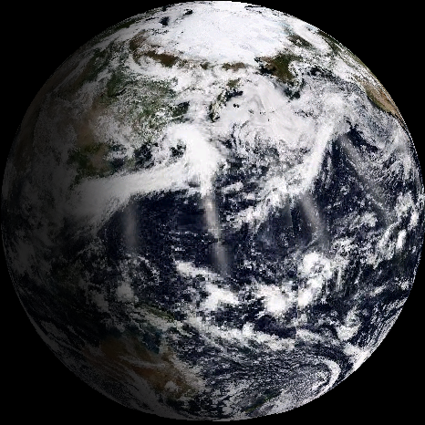
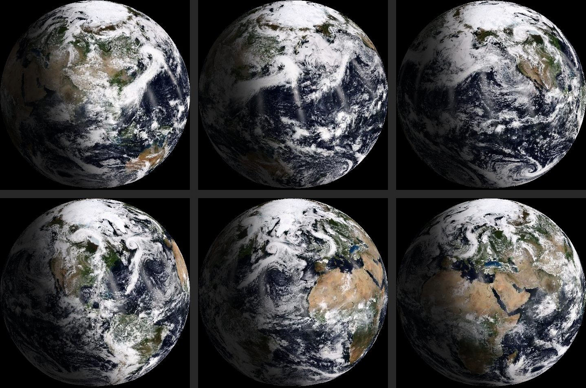
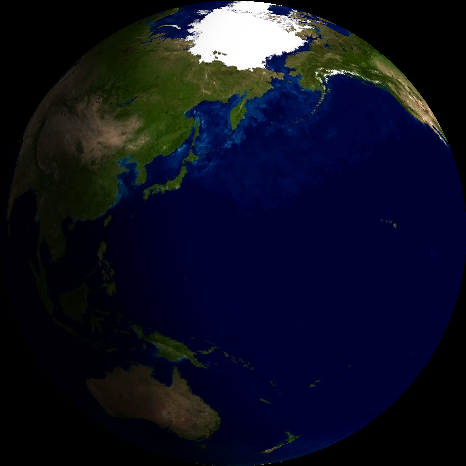
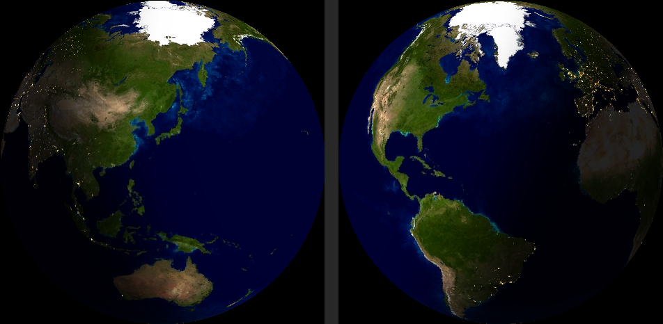
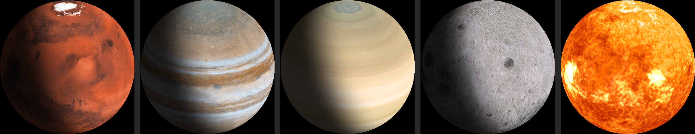
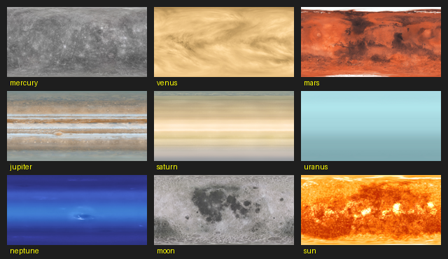
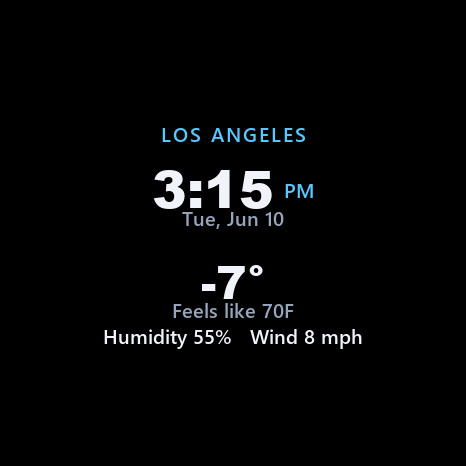

# Weather Globe — Screenshots

A visual tour of the Weather Globe's features.

> **What these are.** The device's CO5300 AMOLED can't be screen-captured, so every image
> here is a **host render-replica** — the firmware's exact rendering math (projection,
> day/night lighting, textures, the card atlas) reproduced pixel-for-pixel on the desktop.
> This is the same verification harness the project used to check visuals before flashing
> (see ADR-007). What you see is what the panel shows. The card image uses the **shipped**
> full-screen design (not the early floating-panel concept that was abandoned — see
> ENGINEERING-JOURNAL deep-dive #6).

---

## 1. Live Earth with NASA clouds
**`weather-globe_01_live-earth-with-clouds.png`**

The headline view: a sun-synchronous Earth with **live NASA VIIRS true-color cloud cover**
draped over it and a soft day/night terminator. The lit hemisphere is wherever the Sun
actually is for the current date and time.

## 2. Live Earth — rotation, multiple views
**`weather-globe_02_live-earth-six-views-rotation.png`**

Six frames of the live cloud Earth at different rotations, showing how the globe turns and
how the real cloud systems and continents track around it.

## 3. Day / night terminator
**`weather-globe_03_day-night-terminator.png`**

A clean look at the real day/night line — the daylit hemisphere bright, the night side
falling off to a dark floor through a soft smootherstep twilight band. The camera is tilted
to bring more of the northern hemisphere into view.

## 4. City lights on the night side
**`weather-globe_04_city-lights-night-side.png`**

NASA **Black Marble** city lights glow on the night side only (Earth only). The right panel
shows the Americas after dark, city lights picking out the populated coasts; the day side
never shows them.

## 5. Selectable planets
**`weather-globe_05_selectable-planets.png`**

The same renderer drives ten selectable bodies. Here: Mars, Jupiter, Saturn, the Moon, and
the Sun — each rendered as the device shows it, with the real day/night terminator applied to
every body except the self-luminous Sun.

## 6. The full body-texture set
**`weather-globe_06_body-texture-set.png`**

The complete set of surface textures shipped in flash — Mercury, Venus, Mars, Jupiter,
Saturn, Uranus, Neptune, the Moon, and the Sun (plus Earth, which uses the live VIIRS map).
Any of these can be selected from the web settings page.

## 7. Time + weather card (shipped design)
**`weather-globe_07_time-and-weather-card.png`**

The optional full-screen **time + weather card** that appears on a chosen cadence: city,
12-hour time with AM/PM, day and date, current temperature (with a degree symbol and a
correct minus sign for sub-zero), feels-like, humidity, and wind. It's a full-screen black
watch face — the design that survived the panel's even-alignment constraint. Data comes from
ip-api.com + Open-Meteo, no API key. (The `-7°` / `Feels like 70F` values here are test data
exercising the negative-temperature path.)

---

## Features covered

| Feature | Image |
|---|---|
| Sun-synchronous live Earth | 1, 2, 3 |
| Live NASA VIIRS clouds | 1, 2 |
| Real day/night terminator | 1, 2, 3 |
| Black Marble city lights | 4 |
| Globe rotation / time-lapse | 2 |
| Ten selectable bodies | 5, 6 |
| Time + weather card | 7 |

*Not pictured (they're config UI, not globe display): the captive-portal WiFi setup and the
web settings page. These can be added if wanted.*

*Images are host render-replicas of the `ai_eye_globe` firmware; see the companion
[CASE-STUDY](../CASE-STUDY.md) and [ENGINEERING-JOURNAL](../ENGINEERING-JOURNAL.md).*
